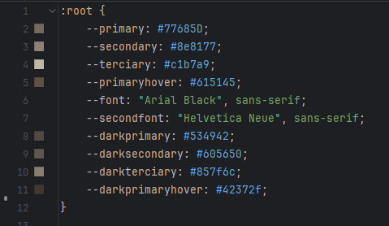
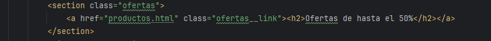

# Proyecto-de-Lenguaje-de-Marcas-2

Para este proyecto decidí hacer una página web de venta de CDs, la cual llamé CDShop.

La página principal recibe al usuario con la cabecera, donde vienen incluidos tanto el logo de la página como
las distintas páginas a las que se puede acceder.

Además, esta posee un buscador y un botón de modo oscuro que,
aunque no sea funcional aún, está maquetado para que funcione con sus respectivos colores.

Lo primero que el usuario observa son las ofertas más recientes moviéndose de un lado de la pantalla a otro,
donde se le puede dar click para acceder a los productos.

También incluye una sección con lanzamientos populares y otras recomendaciones. Darle click a una de las imágenes
te lleva también a la página de productos.

Más abajo se encuentra una sección dedicada al inicio de sesión para poder otorgar mayor precisión al usuario
en cuanto a recomendaciones. Dándole click al login te lleva a la página de inicio de sesión

Finalmente, la página posee un pie de página con la información de la página: Sus redes sociales y página de contacto.

Tanto la cabecera como el pie de página son universales.

Pasando a los productos, esta te recibe con diversos álbumes con sus nombres respectivos precios, además de un
filtro para poder ver distintos productos.
Esta página también incluye una sección de sugerencias basada en la búsqueda del usuario.

En términos de la página de inicio de sesión, esta recibe al usuario con un formulario para crearse una cuenta,
además de mostrar las múltiples mejoras que recibe por crearse una cuenta.
Por otro lado, esta página también muestra algunos álbumes que el usuario podría recibir gracias a iniciar sesión.

Por último, la página de contacto tiene un diseño simple: Muestra una sección recibiendo al usuario, otra
mostrando los distintos motivos por lo que el usuario podría contactar con la empresa y un formulario para
rellenar acerca del problema en cuestión

---

En términos de distribución, todas las páginas fueron estructuradas en HTML y todos los estilos fueron incluidos en 
una única página de css. Aquí se utilizaron las variables para facilitar el cambio de los colores y mantener una
mejor organización

Todas las páginas están dividas en 3 sección distintas, de forma que hay un total de 12 secciones.
1) La primera sección se trata de la animación de la oferta. 

Su estructura HTML es bastante simple, sin embargo su CSS es donde 