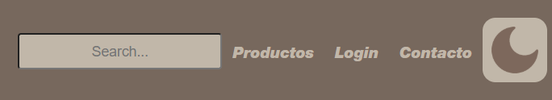
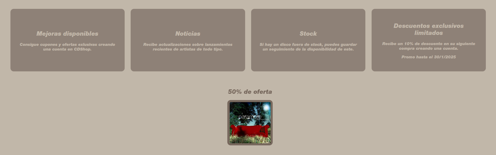

# Proyecto-de-Lenguaje-de-Marcas-2

Para este proyecto decidí hacer una página web de venta de CDs, la cual llamé CDShop.

La página principal recibe al usuario con la cabecera, donde vienen incluidos tanto el logo de la página como
las distintas páginas a las que se puede acceder.

Además, esta posee un buscador y un botón de modo oscuro que,
aunque no sea funcional aún, está maquetado para que funcione con sus respectivos colores.

Lo primero que el usuario observa son las ofertas más recientes moviéndose de un lado de la pantalla a otro,
donde se le puede dar click para acceder a los productos.

También incluye una sección con lanzamientos populares y otras recomendaciones. Darle click a una de las imágenes
te lleva también a la página de productos.

Más abajo se encuentra una sección dedicada al inicio de sesión para poder otorgar mayor precisión al usuario
en cuanto a recomendaciones. Dándole click al login te lleva a la página de inicio de sesión

Finalmente, la página posee un pie de página con la información de la página: Sus redes sociales y página de contacto.

Tanto la cabecera como el pie de página son universales.

Pasando a los productos, esta te recibe con diversos álbumes con sus nombres respectivos precios, además de un
filtro para poder ver distintos productos.
Esta página también incluye una sección de sugerencias basada en la búsqueda del usuario.

En términos de la página de inicio de sesión, esta recibe al usuario con un formulario para crearse una cuenta,
además de mostrar las múltiples mejoras que recibe por crearse una cuenta.
Por otro lado, esta página también muestra algunos álbumes que el usuario podría recibir gracias a iniciar sesión.

Por último, la página de contacto tiene un diseño simple: Muestra una sección recibiendo al usuario, otra
mostrando los distintos motivos por lo que el usuario podría contactar con la empresa y un formulario para
rellenar acerca del problema en cuestión

---

En términos de distribución, todas las páginas fueron estructuradas en HTML y todos los estilos fueron incluidos en 
una única página de css. Aquí se utilizaron las variables para facilitar el cambio de los colores y mantener una
mejor organización

Todas las páginas están dividas en 3 sección distintas, de forma que hay un total de 12 secciones. 

La primera sección se trata de la animación de la oferta. 

Su estructura HTML es bastante simple, sin embargo cabe destacar la animación de su CSS:

Aquí, el rectángulo se mueve desde la derecha y va cambiando de color intermitentemente.

La siguiente sección se trata de los lanzamientos, donde cabe destacar una cosa importante acerca del proyecto:
El uso de etiquetas. Todas las etiquetas tienen un propósito, y es por esto que cabe destacar la diferencia entre las
etiquetas utilizadas para agrupar contenido.

Para agrupar distintas etiquetas y contenido, pueden utilizarse sections, articles y divs.

Los sections se utilizan para agrupar contenido relacionado entre sí, mientras que los articles pueden funcionar
por su propia cuenta sin necesitar información externa.

Sin embargo, los sections y articles requieren del uso de headings con jerarquía. Es por esto que cuando es
necesario agrupar contenido y no cabe la posibilidad de introducir un heading se deberá usar un div como último
recurso.

Es por esto que se utilizan diversos divs a lo largo de la estructura HTML, puesto que muchas de las 
imágenes requerían ser agrupadas dentro de una etiqueta, pero no había forma de introducir un heading coherente,
por lo que se utilizó divs en múltiples ocasiones. Dicho esto, esta es la estructura HTML:

Como se puede comprobar, solo se usan divs en situaciones donde se deben agrupar imágenes sin texto alguno. 

Continuando por la sección inferior, las recomendaciones simplemente están conformadas por una sección con un enlace a la creación de cuenta:

En términos de la página de productos, la página está dividida en dos: La parte izquierda y la parte derecha. Esto se debe al filtro, ya
que este está al mismo nivel que los productos y ocupa un porcentaje de la pantalla.
En la parte izquierda se encuentra el filtro, donde se utilizó forms de tipo radio para poder escoger únicamente una entre todas las opciones
de ordenación, incluso si solo está maquetado y no funcione realmente.
Por otro lado, la parte derecha está conformada por los productos, donde se encuentra tanto la imagen del disco como su descripción.
De esta forma, toda esta estructura eso se vería así:

Para terminar con esta página llegamos a la sección de sugerencias, donde todo está dividido en varias secciones.

Siguiendo por la página del login, aquí se pueden ver estructuras más complejas, como la primera, donde hay un formulario junto 
a una foto todo dentro de una misma caja. De esta forma, esta página tiene la siguiente estructura, siempre respetando el uso apropiado de
las etiquetas adecuadas para no caer en la trampa de usar únicamente divs genéricos:

Más adelante se encuentran el conjunto de cajas, cuya estructura es bastante simple:

Para terminar con esta página tenemos la sección de abajo que, como la animación en la página de bienvenida, esta se mueve de un lado de la pantalla
a otro, usando la misma animación pero bajo un contexto distino. 

Además, esta se frena en seco al poner el ratón encima, ya que es más
difícil de darle debido a su pequeño tamaño. Esto es posible gracias a la siguiente línea de código:

Por último tenemos la página de contacto, donde recibe al usuario con una parte superior introductoria que ocupa toda la pantalla.
Su estrucura es la siguiente:

Luego está el conjunto de motivos para contactar con la empresa, dividida en 3 cajas que contienen texto.

Por último está el formulario, donde caben destacar algunas etiquetas.
Aquí se utilizan checkboxes, radios, date, text, reset, submit

Las radios se han explicado previamente, y las checkboxes funcionan como estas pero permite escoger múltiples a la vez.

Los text permiten al usuario introducir texto, mientras que las date solo aceptan fechas

Y para terminar, reset sirve para reiniciar y eliminar la información del formulario mientras que submit permite al usuario enviar su respuesta.

Esta es la estructura:
